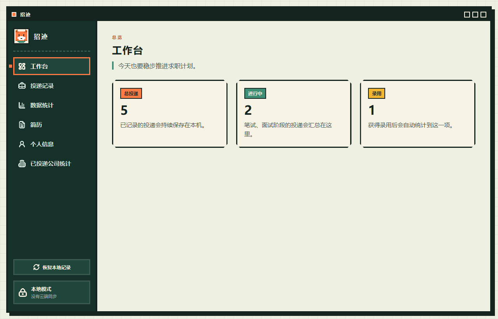
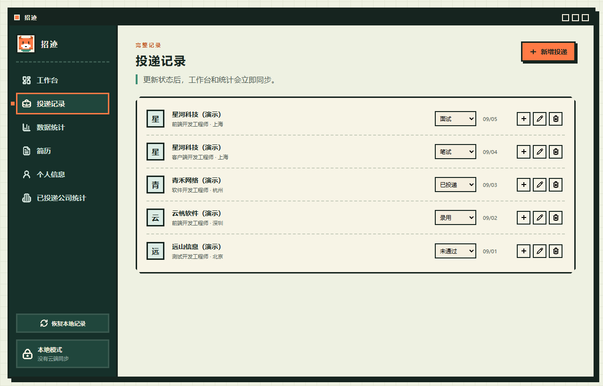
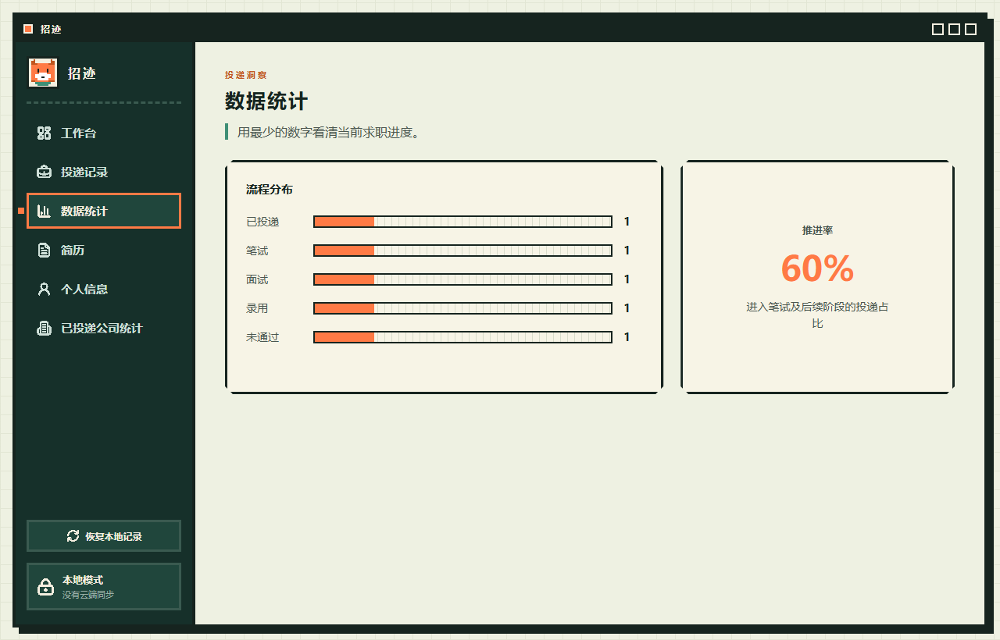
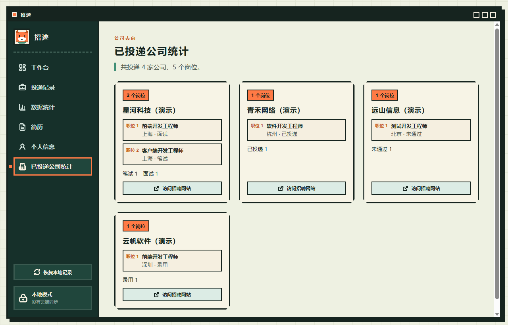

# 招迹

一款本地优先的 Windows 校招投递管理应用。用中文像素风工作台记录投递、跟进进度、整理简历和个人资料，无需注册账号。

[下载安装](https://github.com/wuzenghui27-wq/campus-flow/releases) · [反馈问题](https://github.com/wuzenghui27-wq/campus-flow/issues)

## 功能

- **投递管理**：新增、编辑和删除记录，记录公司、职位、城市、日期和招聘网站。
- **状态跟踪**：支持「已投递」「笔试」「面试」「录用」「未通过」。
- **同公司多岗位**：复制公司信息、清空职位后另存，减少重复填写。
- **数据统计**：查看总投递、进行中、录用、流程分布和公司汇总。
- **简历管理**：选择 PDF、使用系统阅读器打开，并提取简历中的个人资料。
- **个人资料**：管理基础信息、教育、工作、实习、项目、实践活动、奖励、技能与语言。
- **自动填写**：生成浏览器书签，辅助填写招聘网站表单。
- **本地存储**：数据保存在电脑中，支持备份恢复；核心记录管理可离线使用。

## 界面预览

截图中的公司与投递均为虚构演示数据。

### 工作台



### 投递记录



### 数据统计



### 已投递公司



## 下载安装

1. 在 [Releases](https://github.com/wuzenghui27-wq/campus-flow/releases) 下载 `campus-flow-setup-版本号.exe`。
2. 运行安装包，按提示完成安装。
3. 从桌面或开始菜单的「招迹」快捷方式打开应用。

支持 Windows x64。下载页以实际发布版本为准，可能与主分支代码不同。当前主分支支持选择安装位置，不再生成便携版。

> 数据保存在本机的「招迹数据」目录中。请确保数据目录可写，并在升级或更改安装位置前备份数据。

## 使用方法

### 记录投递

打开「投递记录」，点击「新增投递」，填写公司、职位、城市、投递日期和当前状态。招聘网站为选填项，可在「已投递公司统计」中直接访问。

记录行上的状态下拉框可直接更新进度；编辑按钮用于修改详情，删除按钮会要求确认。点击加号，可沿用该公司的信息，为另一个职位新增记录。

「未通过」记录仍保留在总投递和公司统计中，不计入「进行中」或「录用」。

### 管理简历与资料

在「简历」中选择一份 PDF。应用保存原文件路径，选择或替换简历后会尝试提取个人信息。扫描版会尝试本机 OCR，可能需要 Windows 中文识别语言组件。请核对识别结果，并在「个人信息」中补充或修改。

简历原文件移动或删除后，需要重新选择。

### 自动填写招聘表单

在「个人信息」中，将「自动填写资料」按钮拖到 Chrome 或 Edge 的书签栏。打开招聘网站的表单页面，再点击该书签尝试填写。

不同网站的表单结构不同，填写后请人工核对。修改个人资料后需重新生成书签。书签包含个人资料，请勿公开分享；浏览器书签同步可能同步这些内容，在招聘网站执行时会将资料填入该网站。

### 恢复记录

点击侧栏「恢复本地记录」，应用会从主文件、备份和旧版文件中选取记录较多的有效快照。恢复后请核对内容，之前主动删除的记录也可能重新出现。

### 更新版本

联网启动后，应用会检查 GitHub Releases。有新版本时，侧栏显示更新按钮，点击后下载并安装。更新检查需要网络，投递管理不需要联网。

## 数据保存

- 主文件：数据目录中的 `data.json`
- 备份文件：同目录下的 `data.json.bak`
- 投递记录和个人资料没有云端同步。
- 简历只保存本地路径，不上传 PDF。
- 备份或手动迁移数据前，请先正常关闭应用，再复制数据文件。
- 卸载或更新程序时，请保留数据目录。

读取失败时会显示错误页和数据路径。可尝试重新读取，或打开目录检查文件权限。保存失败时请根据提示处理后再退出。

## 本地开发

技术栈：React、TypeScript、Electron、Vite、electron-builder。

需要 Windows x64、Node.js 22.6+（推荐 Node.js 22 LTS 最新补丁版本）和 npm。

```powershell
git clone https://github.com/wuzenghui27-wq/campus-flow.git
cd campus-flow
npm ci
npm run build
npm run desktop
```

```powershell
npm test          # 运行测试
npm run build     # 类型检查和前端构建
npm run dist:win  # 生成 Windows 安装包
```

Electron 加载 `dist` 中的构建文件，修改前端后需要重新构建。`npm run dev` 仅启动 Vite，不包含桌面接口，不能替代完整应用。

安装包输出到 `release/`。创建并推送 `v版本号` 标签后，GitHub Actions 会自动测试、打包并发布。
